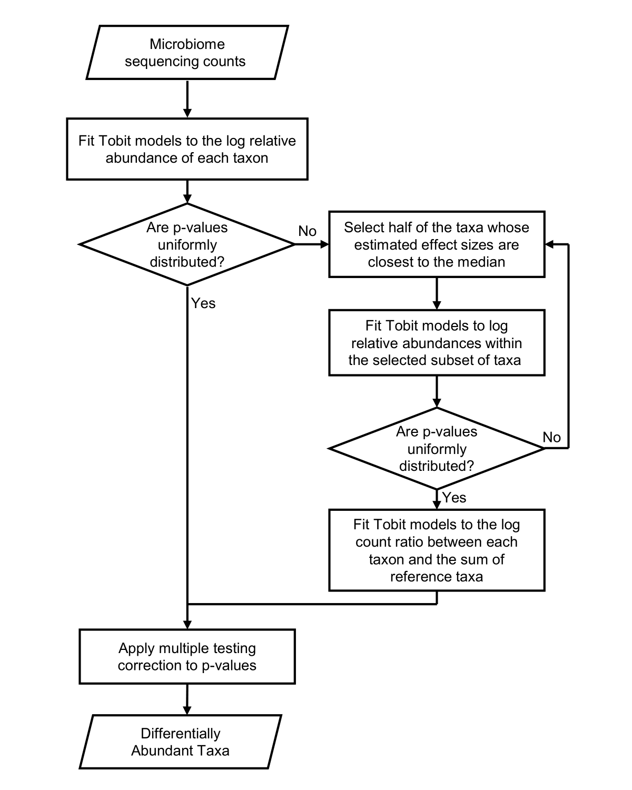

```{r, include = FALSE}
knitr::opts_chunk$set(
  collapse = TRUE,
  comment = "#>"
)
```


# Introduction

This is the tutorial for `ADAPT` (analysis of microbiome differential abundance analysis by pooling Tobit models). Differential abundance analysis (DAA) is one of the fundamental steps in microbiome research [@LiReview]. The metagenomics count data have excessive zeros and are compositional, causing challenges for detecting microbiome taxa whose abundances are associated with different conditions. `ADAPT` overcomes these challenges differently from other DAA methods. First, `ADAPT` treats zero counts as left censored observations and apply Tobit models which are censored regressions [@tobit] for modeling the log count ratios. Second, `ADAPT` has an innovative and theoretically justified way of finding non-differentially abundant taxa as reference taxa. It then applies Tobit models to log count ratios between individual taxa and the summed counts of reference taxa to identify differentially abundant taxa. The overall workflow is presented in the graph below.

```{r echo=FALSE, out.width='70%', fig.align = "center", fig.cap="Workflow of ADAPT"}

```

There are two ways to install the package, either through GitHub or Bioconductor.

```{r, eval=FALSE}
# install through GitHub
if(!require("ADAPT")) BiocManager::install("mkbwang/ADAPT", build_vignettes = TRUE)

# install through Bioconductor
if(!require("ADAPT")) BiocManager::install("ADAPT", version="devel", 
                                           build_vignettes = TRUE)

```

# Main function `adapt`

The main function `adapt` takes in a phyloseq [@phyloseq] object that needs to have at least a count table and a sample metadata. The metadata must contain one variable that represents the condition to test on. We currently allow binary and continuous conditions. If there are more than two groups for the condition variable, the user may single out one group to compare with all the others for DAA. `ADAPT` allows adjusting for extra covariates. There are eight arguments in the `adapt` function: 

1. `input_data` is the phyloseq object with the count matrix and metadata. This argument is required.
2. `cond.var` is the variable in the metadata that represents the condition to test on. This argument is required.
3. `base.cond` is the group that the user is interested in comparing against other groups. This argument is only needed if the condition is categorical.
4. `adj.var` contains the covariates to adjust for. It can be empty or be a vector of variable names.
5. `censor` is the value to censor at for all the zero counts. By default the zeros are censored at one.
6. `prev.filter` is the threshold for filtering out rare taxa. By default taxa with prevalence lower than 0.05 are filtered out before analysis.
7. `depth.filter` is the threshold for filtering out samples with low sequencing depths. The default threshold is 1000 reads.
8. `alpha` is the cutoff for the Benjamini-hochberg adjusted p-values to decide differentially abundant taxa. The default is 0.05.

The `ADAPT` package contains two metagenomics datasets from an early childhood dental caries study [@ECCpaper1]. One corresponds to 16S rRNA sequencing of 161 saliva samples collected from 12-month-old infants (`ecc_saliva`). The other corresponds to shotgun metagenomic sequencing of 30 plaque samples collected from kids between 36 and 60 months old (`ecc_plaque`). In this vignette let's use the saliva data to find out differentially abundant taxa between kids who developed early childhood caries (ECC) after 36 months old and those who didn't. Besides the main variable `CaseStatus`, there is another variable `Site` representing the site where each sample was collected. Both variables are discrete and contain two categories each.  

```{r load data}
library(ADAPT)
data(ecc_saliva)
```

We can run `adapt` with or without covariate adjustment. The returned object is a customized S4-type object with slots corresponding to analysis name, reference taxa, differentially abundant taxa, detailed analysis results (a dataframe) and input phyloseq object.


```{r adapt}
saliva_output_noadjust <- adapt(input_data=ecc_saliva, cond.var="CaseStatus", base.cond="Control")
saliva_output_adjust <- adapt(input_data=ecc_saliva, cond.var="CaseStatus", base.cond="Control", adj.var="Site")
```


The `Site` is not a confounding variable, therefore the DAA results only differ by one taxon. 

# Explore Analysis Results

We have developed two utility functions for result exploration. `summary` returns a dataframe with the estimated log10 abundance fold changes, hypothesis test p-values and taxonomy (if provided in the phyloseq object). The user can choose to return results of all the taxa, the differentially abundant taxa only or the reference taxa only through the `select` variable ("all", "da" or "ref"). We choose to return the results of only the DA taxa below.

```{r getsummary}
DAtaxa_result <- summary(saliva_output_noadjust, select="da")
```

```{r printtable}
head(DAtaxa_result)
```


We have also developed a `plot` function to generate a volcano plot. The DA taxa are highlighted in red. The user can decide how many points with the smallest p-values are labeled (default 5) with `n.label` argument.


```{r volcano, fig.width=5, fig.height=3, fig.align = "center", fig.cap="Volcano plot for differential abundance analysis between saliva samples of children who developed early childhood dental caries and those who didn't"}
plot(saliva_output_noadjust, n.label=5)
```

# Session Information and References
```{r sessioninfo}
sessionInfo()
```
